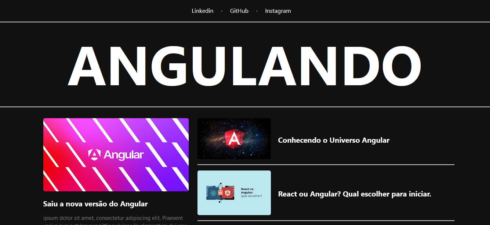

# Módulo Explorando o Angular Framework 

## Criando um blog com ANGULAR

## Conteúdo
- Preparando o ambiente de produção e versionamento no GitHub;
- Enxergando os componentes em um layout;
- Criando a base dos components;
- Menu title;
- Criando a estrutura do big card;
- Concentrando o big card;
- Desenhando small cards;
- Criando o componente do menu;
- Commitando projeto e editando online;
- Agregando múltiplos CSS para um component;
- Desacoplando os componentes da parte visual;
- Criando outras páginas;
- Pegando os dados dinamicamente;
- Deixando a content page dinâmica;

## Resultado:
Todas as notícias são clicáveis e encaminham para a notícia específica de cada card.  
Para voltar a página inicial pode utilizar o botão de voltar do navegador ou clicar no nome do blog "ANGULANDO".  
Na barra navegação possui os links para todas as mídias sociais representadas. 
Os textos das notícias são fictícios assim como o conteúdo dos artigos.

### Página Inicial

#

#

##

### Página de Notícia

#

